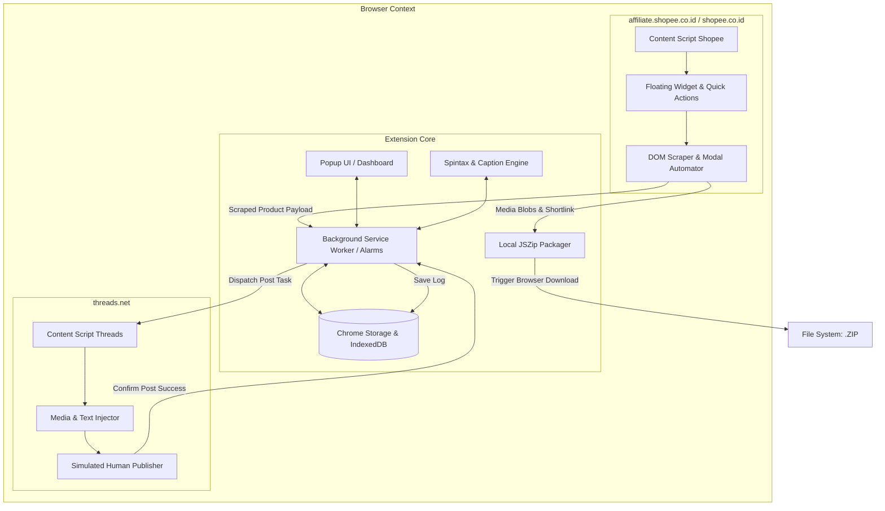
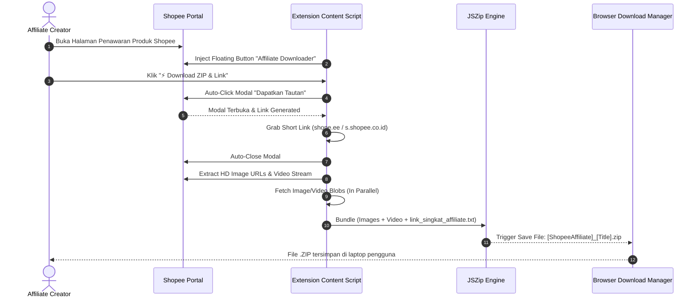
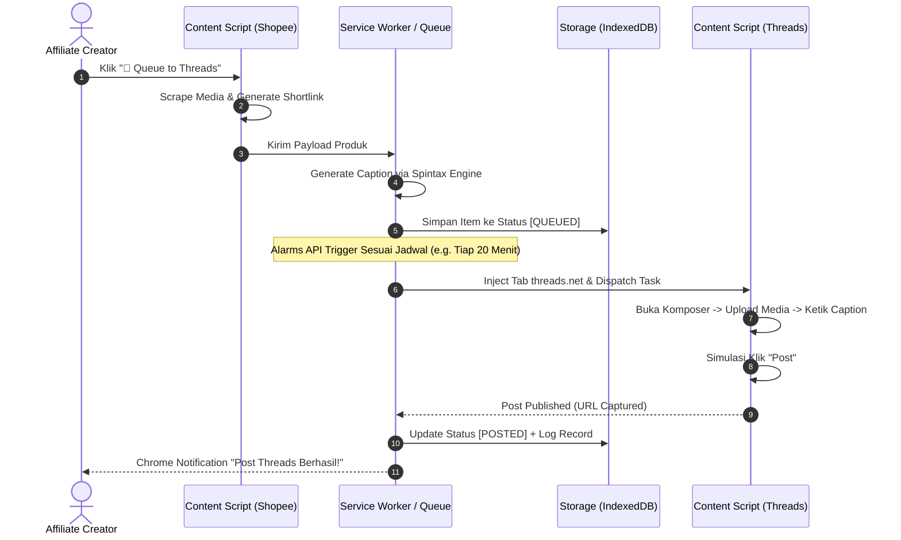
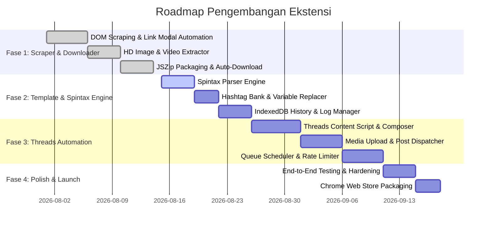

# 📄 Product Requirement Document (PRD)

---

## 📌 Metadata Dokumen
- **Nama Produk:** Shopee Affiliate Downloader & Threads Auto-Poster
- **Tipe Produk:** Google Chrome Extension (Manifest V3)
- **Versi Dokumen:** v1.0.0
- **Status:** Approved / In Development
- **Owner / Author:** sodikinnaa
- **Target Pengguna:** Affiliate Marketers, Content Creators, Digital Dropshippers (Shopee & Meta Threads)
- **Terakhir Diperbarui:** 15 Agustus 2026

---

## 1. 🎯 Executive Summary & Visi Produk

### 1.1 Latar Belakang & Problem Statement
Ekosistem affiliate marketing di Indonesia berkembang pesat, khususnya pada platform **Shopee Affiliate Program**. Namun, alur kerja operasional harian affiliate creator masih sangat manual dan memakan waktu:
1. **Manual Link Generation:** Creator harus membuka detail produk, mengklik modal "Dapatkan Tautan", menyalin short link, dan mencatatnya satu per satu.
2. **Kualitas Media Rendah:** Mengunduh gambar produk secara manual via web sering kali hanya menghasilkan thumbnail resolusi rendah (`_tn`) atau terkompresi.
3. **Multi-Platform Posting Bottleneck:** Menyebarkan konten ke **Meta Threads** membutuhkan proses manual: download aset ke laptop/HP, buka Threads Web, upload gambar/video, buat variasi caption, dan tempel tautan afiliasi.
4. **Resiko Spam/Shadowban di Threads:** Memposting link yang sama berulang kali dengan caption identik menyebabkan akun dibatasi oleh sistem anti-spam Meta Threads.

### 1.2 Visi & Solusi Produk
**Shopee Affiliate Downloader & Threads Auto-Poster** adalah ekstensi browser Chrome (Manifest V3) *all-in-one* yang mengotomatisasi seluruh alur kerja dari *hulu ke hilir*:
- **Ekstraksi Instan:** Sekali klik untuk scrape detail produk, generate short link affiliate resmi, dan bundle seluruh aset HD (gambar + video + info produk) ke file `.ZIP`.
- **Otomasi Distribusi Threads:** Menjembatani aset Shopee langsung ke komposer Threads Web secara otomatis, dilengkapi caption generator cerdas (Spintax) dan antrean penjadwalan (queue scheduler).
- **Keamanan & Privasi:** 100% berjalan secara lokal di sisi klien (Client-Side Extension), tanpa server perantara pihak ketiga, menjaga kerahasiaan sesi akun dan kredensial pengguna.

---

## 2. 👥 User Personas & Target Audience

| Persona | Profil & Karakteristik | Pain Point Utama | Kebutuhan Solusi |
| :--- | :--- | :--- | :--- |
| **Budi – Full-time Affiliate Creator** | Memiliki 10+ akun media sosial, memposting 30-50 produk per hari di Threads & X. | Waktu terbuang 3-4 jam per hari hanya untuk download gambar dan copy-paste link manual. | Batch download ZIP instan, otomatisasi posting Threads dengan delay acak agar tidak terkena ban. |
| **Siti – Side-Hustle Creator** | Karyawan kantor yang mengelola akun affiliate pada malam hari dan akhir pekan. | Sering lupa memposting secara konsisten; kesulitan membuat caption yang bervariasi. | Queue/Scheduler lokal, Spintax Caption Generator agar caption selalu unik secara otomatis. |
| **Reza – Digital Agency / Brand Builder** | Mengelola katalog penawaran affiliate untuk jaringan influencer. | Repot membagikan raw asset ke tim konten karena format media tidak terstruktur. | Ekspor ZIP rapi (nama file terindeks, TXT info lengkap dengan link komisi). |

---

## 3. 🏗️ Arsitektur Teknis & Spesifikasi Sistem

### 3.1 Spesifikasi Platform
- **Extension Architecture:** Google Chrome Extensions **Manifest Version 3 (MV3)**
- **Runtime Environment:** Chromium Browsers (Google Chrome 110+, Microsoft Edge, Brave, Opera)
- **Core Languages & Libraries:**
  - Vanilla JavaScript (ES6+ Modules)
  - HTML5 & CSS3 (Custom Design System, tanpa heavy external runtime)
  - `JSZip v3.10+` (Client-side ZIP compression)
- **Storage Strategy:**
  - `chrome.storage.local`: Pengaturan template, state antrean, konfigurasi spintax, auth cache.
  - `IndexedDB`: Riwayat log scraping & posting (high volume data log & media cache).

### 3.2 Diagram Arsitektur Sistem



### 3.3 Manifest Permissions & Host Scope
```json
{
  "manifest_version": 3,
  "name": "Shopee Affiliate Downloader & Threads Auto-Poster",
  "version": "1.0.0",
  "permissions": [
    "activeTab",
    "storage",
    "alarms",
    "downloads",
    "scripting"
  ],
  "host_permissions": [
    "*://affiliate.shopee.co.id/*",
    "*://*.shopee.co.id/*",
    "*://*.susercontent.com/*",
    "*://*.shopeemobile.com/*",
    "*://*.threads.net/*"
  ]
}
```

---

## 4. 🚀 Rincian Modul & Kebutuhan Fungsional

### 4.1 Module 1: Shopee Affiliate Scraper & Short Link Generator

#### A. Deskripsi
Modul yang bertugas mengekstraksi data produk dari Shopee Affiliate Portal / Katalog Produk Shopee, mengotomatisasi pembuatan short link resmi, serta mengunduh aset gambar dan video kualitas maksimal.

#### B. Fitur & Alur Kerja Spesifik
1. **Contextual Floating Action Button (FAB):**
   - Menempel di pojok kanan bawah halaman `affiliate.shopee.co.id` dan `shopee.co.id`.
   - Menampilkan status deteksi produk (Active / Ready to Scrape).
   - Menyediakan 2 tombol cepat: `⚡ Quick Download ZIP` dan `🚀 Send to Threads Queue`.
2. **Automated Link Generator (DOM Simulation):**
   - Ekstensi mendeteksi tombol *“Dapatkan Tautan” / “Get Link”* pada kartu produk atau halaman detail penawaran.
   - Melakukan programmatically click untuk membuka modal resmi Shopee Affiliate.
   - Menunggu DOM modal render (timeout: 5000ms), lalu menyalin link pendek yang ter-generate (`https://s.shopee.co.id/...` atau `https://shope.ee/...`).
   - Menyediakan input konfigurasi `Sub-ID` (Sub_id1 s/d Sub_id5) yang disisipkan otomatis ke parameter link jika diaktifkan.
   - Menutup modal kembali secara otomatis (*clean cleanup*).
3. **HD Media Extractor (Zero Quality Loss):**
   - **Image Scraping:** Menemukan seluruh tag gambar produk (`carousel`, `thumbnail-list`, `detail-image`).
   - **URL Sanitization & Upscaling:** Membersihkan suffix resolusi rendah seperti `_tn`, `_heic`, `_100x100`, `_320x320` menjadi URL raw source resolusi penuh (`1024x1024` atau raw upload).
   - **Video Extractor:** Mendeteksi elemen `<video>` atau blob Shopee Cloud Video, mengambil stream URL `.mp4` asli tanpa watermark overlay DOM.
4. **JSZip Packaging & Export:**
   - Memproses kompresi aset di sisi klien (*in-memory blob* via `JSZip`).
   - Struktur file ZIP:
     ```text
     📦 [ShopeeAffiliate]_[ProductID]_[SanitizedTitle]/
     ├── 📄 link_singkat_affiliate.txt   # Info Produk, Harga, Komisi, Shortlink
     ├── 🖼️ image_01.jpg
     ├── 🖼️ image_02.jpg
     ├── 🖼️ image_03.jpg
     └── 🎥 video_product.mp4           # Jika produk memiliki video
     ```

---

### 4.2 Module 2: Auto-Post & Queueing to Meta Threads

#### A. Deskripsi
Modul otomatisasi distribusi konten yang mengunggah aset media, merangkai caption berserta short link affiliate, dan mempublikasikan post ke platform Meta Threads Web (`threads.net`).

#### B. Fitur & Alur Kerja Spesifik
1. **Threads Web Session Detector:**
   - Memeriksa ketersediaan sesi aktif di `threads.net`. Jika belum login, munculkan instruksi pop-up: *"Silakan login ke Threads Web di tab browser Anda"*.
2. **Automated Composer Injection:**
   - Membuka / mengarahkan tab ke `threads.net` atau beroperasi di background tab.
   - Membuka komposer post Threads (simulasi klik tombol "Start a thread" / shortcut).
3. **Media Payload Dispatcher:**
   - Menginjeksi file gambar / video langsung ke input file komposer Threads menggunakan `DataTransfer` dan `File` API browser.
   - Mendukung multi-image carousel (hingga 10 foto) atau 1 video per thread.
4. **Caption & Link Pasting:**
   - Mengetikkan konten teks yang dihasilkan oleh Caption Engine ke dalam `contenteditable` / textarea Threads dengan simulasi *keystroke dispatch* untuk memastikan event react/state Threads menangkap input.
5. **Posting Modes:**
   - **Instant Post:** Posting langsung saat tombol diklik.
   - **Queue / Scheduled Engine:** Produk dimasukkan ke dalam antrean lokal. Extension Background Worker mengeksekusi posting secara berkala berdasarkan interval waktu yang ditentukan (misal: 1 post tiap 15-30 menit).
6. **Anti-Detection & Safe Posting Guard:**
   - **Humanized Random Delay:** Memberikan jeda acak (jitter) 45 - 180 detik antar postingan.
   - **Daily Post Limiter:** Batas kuota harian (maksimal 20-30 post/hari) untuk menjaga *trust score* akun Threads.

---

### 4.3 Module 3: Template Caption & Spintax Manager

#### A. Deskripsi
Engine generator teks dinamis dengan sintaks Spintax untuk memastikan setiap konten yang diunggah ke Threads memiliki struktur kalimat yang bervariasi dan tidak teridentifikasi sebagai *duplicate spam*.

#### B. Fitur & Format Spintax
1. **Spintax Engine Parser:**
   - Mendukung format standar: `{Pilihan 1|Pilihan 2|Pilihan 3}`.
   - Mendukung **Nested Spintax** (Spintax bersarang):
     `{{Rekomendasi|Spill}|{Racun Shopee|Barang unik}} hari ini: {nama_produk}!`
2. **Dynamic Variables (Tagging):**
   - `{nama_produk}` : Judul produk yang di-scrape dari Shopee.
   - `{harga}` : Harga asli / harga diskon produk.
   - `{diskon}` : Persentase potongan harga (jika ada).
   - `{link_affiliate}` : Short link Shopee Affiliate resmi.
   - `{rating}` : Nilai rating bintang produk (misal: ⭐ 4.9).
   - `{terjual}` : Jumlah unit terjual (misal: 10rb+ terjual).
3. **Hashtag Bank & Randomizer:**
   - Mengelompokkan hashtag per kategori (Fashion, Elektronik, Home Living, Skincare).
   - Fitur *Random Hashtag Picker*: Mengambil 3-5 hashtag secara acak dari kumpulan 20 hashtag per kategori.
4. **Contoh Template Bawaan (Preset):**
   ```text
   {Gila sih ini|Keren banget|Wajib punya nih}! 😍
   {Lagi viral|Banyak yang cari|Rekomendasi terbaik}: {nama_produk}

   💸 Harga: {harga} {diskon ? "(Lagi Diskon " + diskon + ")" : ""}
   ⭐ Rating: {rating} | Terjual: {terjual}

   🔗 {Beli di sini yuk|Cek produknya di sini|Link beli official}:
   {link_affiliate}

   {hashtag_random}
   ```

---

### 4.4 Module 4: History, Analytics & Export Log

#### A. Deskripsi
Pusat pencatatan seluruh aktivitas scraping, pengunduhan aset, dan publikasi Threads untuk kemudahan audit dan pencegahan posting ganda.

#### B. Fitur & Struktur Data
1. **Local Activity Logger:**
   - Menyimpan riwayat setiap transaksi data dalam `IndexedDB`.
   - **Atribut Log:**
     - `id`: UUID
     - `shopee_item_id`: String
     - `product_name`: String
     - `price`: String
     - `affiliate_short_link`: String
     - `media_count`: Number (Foto & Video)
     - `threads_post_url`: String (jika berhasil diposting)
     - `status`: Enum (`SCRAPED`, `ZIP_DOWNLOADED`, `QUEUED`, `POSTED`, `FAILED`)
     - `error_message`: String (nullable)
     - `timestamp`: ISO Date
2. **Duplicate Prevention Guard:**
   - Fitur warning / alert jika user mencoba meng-scrape atau mengantrekan produk yang sudah pernah di-post dalam 7 hari terakhir.
3. **Data Export:**
   - Ekspor riwayat ke file format **CSV** dan **JSON**.

---

## 5. 🔄 User Flow & Alur Kerja Pengguna

### 5.1 Flow 1: One-Click Scrape & Download ZIP


### 5.2 Flow 2: Scrape to Threads Scheduled Queue


---

## 6. ⚠️ Edge Cases, Keamanan & Penanganan Eror

| Skenario Edge Case | Potensi Masalah | Strategi Mitigasi / Penanganan |
| :--- | :--- | :--- |
| **Perubahan Struktur DOM Shopee** | Class name CSS Shopee di-obfuscate atau berubah sewaktu-waktu. | Gunakan multi-fallback selector (atribut `aria-label`, data test ID, relative text matching, dan xpath fallback). |
| **Modal Link Timeout** | Jaringan lambat menyebabkan modal "Dapatkan Tautan" tidak muncul dalam 5 detik. | Implementasi `Retry mechanism` (maksimal 3x percobaan), jika gagal tampilkan notifikasi toast informatif: *"Gagal mengambil link otomatis. Silakan coba lagi."* |
| **Sesi Login Threads Expired** | Akun Threads ter-logout saat antrean background dijalankan. | Deteksi elemen halaman login Threads. Pause antrean otomatis, kirim notifikasi browser: *"Sesi Threads berakhir, silakan login kembali untuk melanjutkan antrean."* |
| **Threads Anti-Spam Rate Limit** | Terlalu banyak post dalam waktu singkat menyebabkan throttling / soft-ban. | - Enforce delay acak (45s - 180s).<br>- Dynamic Spintax wajib aktif.<br>- Maksimal 15 post per batch antrean dengan cool-down 1 jam. |
| **Aset Video Berukuran Besar (>50MB)** | Memory crash pada Service Worker saat kompresi ZIP. | Streaming fetch via chunks / arrayBuffer, batasi blob caching pada IndexedDB, dan bypass kompresi level (Store mode / Level 0). |
| **Service Worker MV3 Inactivity** | Chrome MV3 Service Worker mati otomatis setelah 30 detik idle. | Gunakan `chrome.alarms` API untuk me-wake up Service Worker secara persisten pada jadwal antrean. |

---

## 7. 🛡️ Non-Functional Requirements (NFR)

1. **Performa & Kecepatan:**
   - Waktu ekstraksi detail produk & link modal < 2.5 detik.
   - Waktu kompresi ZIP untuk 8 foto HD < 3 detik.
2. **Privasi & Keamanan Data (Zero-Data Leak):**
   - Tidak ada transmisi data cookie, token, atau link affiliate ke server luar. Seluruh proses scraping, penyimpanan, dan posting terjadi 100% di browser pengguna.
   - Tidak meminta permissions yang tidak dibutuhkan (`<all_urls>` dihindari, dibatasi hanya pada domain Shopee & Threads).
3. **Reliabilitas & UI Responsiveness:**
   - Desain UI Popup dan Floating Widget ringan (CSS native, tanpa blocking script).
   - Ekstensi tidak merusak tata letak layout resmi portal Shopee maupun Threads.
4. **Kompatibilitas:**
   - Berjalan mulus di Google Chrome v110+ pada sistem operasi Windows, macOS, dan Linux.

---

## 8. 🗺️ Roadmap & Milestone Implementasi



### Rincian Fase:
- **Fase 1 (MVP - Stabilisasi):** Scraper Shopee, modal auto-clicker, generator shortlink, HD media bundle, dan export ZIP.
- **Fase 2 (Engine Konten & Log):** Implementasi Spintax parser, sistem template dinamis, hashtag bank, dan database riwayat scraping lokal.
- **Fase 3 (Integrasi Threads & Scheduler):** Content script untuk komposer `threads.net`, injector file/media, queue scheduler via `chrome.alarms`, dan pengaman delay acak anti-spam.
- **Fase 4 (Hardening & Rilis):** Testing skenario edge cases, penanganan pembaruan layout Shopee/Threads, dan dokumentasi panduan pengguna.

---

## 9. 📋 Kriteria Penerimaan (Definition of Done)

- [x] Ekstensi berhasil mendeteksi halaman produk Shopee dan menampilkan tombol floating widget.
- [x] Ekstensi berhasil membuka modal "Dapatkan Tautan", menyalin shortlink, dan menutup modal tanpa intervensi manual.
- [x] Gambar yang diunduh beresolusi HD tanpa parameter watermark/thumbnail (`_tn`).
- [x] File ZIP ter-download secara otomatis berisi seluruh gambar, video (jika ada), dan file `link_singkat_affiliate.txt`.
- [ ] Mesin Spintax dapat menghasilkan variasi teks acak dengan benar tanpa error sintaks.
- [ ] Postingan ke Threads berhasil terunggah beserta media dan teks caption yang diformat.
- [ ] Antrean terjadwal mengeksekusi postingan sesuai interval waktu dengan jeda acak yang aman.
- [ ] Seluruh log riwayat tersimpan rapi dan dapat diekspor ke format CSV.

---

*Dokumen ini merupakan panduan spesifikasi resmi untuk implementasi dan pengujian teknis proyek **Shopee Affiliate Downloader & Threads Auto-Poster Chrome Extension**.*
