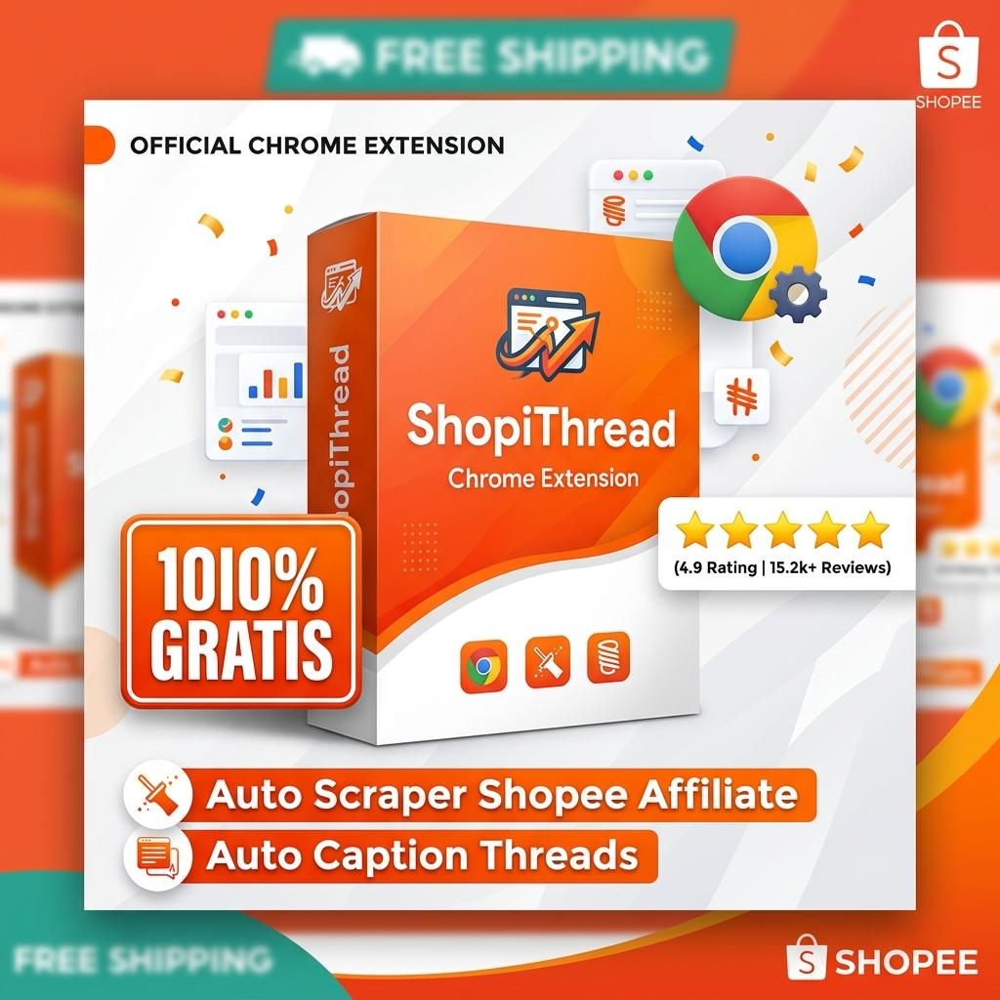

# 🛍️ Template Judul & Deskripsi Produk Gratis di Shopee (Freebies / Digital / Giveaway)



Panduan dan kumpulan template copywriting siap pakai untuk listing **Produk Gratis / Freebie / Digital Tools / Panduan** di Shopee guna memancing traffic, follower toko, dan ulasan bintang 5.

---

## 📌 Rekomendasi Struktur Judul Produk (SEO Shopee)

> **Rumus Judul:** `[GRATIS / FREE] [Kategori / Jenis Produk] [Nama Produk / Brand] [Fitur Utama / Manfaat] [Bonus / Garansi]`

### Opsi Judul Siap Pakai:
1. **Opsi 1 (Digital Tools / Ekstensi Chrome):**
   ```text
   [GRATIS] ShopiThread Chrome Extension - Tool Scraper Shopee Affiliate & Auto Caption Threads 1 Klik
   ```
2. **Opsi 2 (Panduan / Ebook / Template):**
   ```text
   [FREE] Ebook Panduan Rahasia Banjir Order Shopee Affiliate + Template Caption Threads Viral (Gratis Akses)
   ```
3. **Opsi 3 (Universal / Akses Free Trial & Komunitas):**
   ```text
   [PROMO GRATIS Rp0] Software ShopiThread Scraper & Generator Konten Otomatis Shopee Affiliate Terbaru
   ```
4. **Opsi 4 (Voucher / Digital Bonus):**
   ```text
   [GRATIS] Lisensi ShopiThread Extension Full Version - Optimasi Komisi Shopee Affiliate & Scraping Produk
   ```

---

## 📝 Template Deskripsi Produk Siap Pakai

---

### 🔥 Template 1: Khusus Produk Digital / Tools (ShopiThread Extension)

```markdown
🎁 [PROMO SPESIAL GRATIS / RP 0] - SHOPIHREAD CHROME EXTENSION 🎁
Solusi all-in-one untuk kamu para Kreator Konten & Affiliate Marketer Shopee!

Mau bikin konten promosi produk Shopee Affiliate tapi capek scrape foto manual dan bikin caption satu per satu? 
Gunakan ShopiThread sekarang juga — 100% GRATIS!

---

✨ FITUR UNGGULAN:
✅ Scraper Produk & Foto HD: Ambil gambar asli beresolusi tinggi tanpa watermark / blur.
✅ Auto Generate Shortlink Resmi: Otomatis buat link affiliate resmi (s.shopee.co.id) tanpa repot.
✅ Ekspor & Database CSV: Kelola ribuan data produk dengan rapi dan terstruktur.
✅ Generator Caption Meta Threads: Buat teks promosi viral siap posting bebas typo dan karakter rusak.
✅ 100% Aman & Ringan di Browser.

---

📦 APA YANG KAMU DAPATKAN:
1. File Installer Ekstensi Chrome (ShopiThread).
2. Panduan Lengkap Instalasi & Cara Penggunaan (Video & PDF).
3. Template Copywriting Threads Siap Pakai.
4. Akses Update Fitur Terbaru.

---

🚀 CARA KLAIM / PENGIRIMAN PRODUK:
1. Checkout produk ini seperti biasa (Harga promo / Gratis).
2. Setelah pesanan terkonfirmasi, cantumkan ALAMAT EMAIL kamu di catatan order atau kirim via Chat Shopee.
3. Link download dan panduan akses akan langsung dikirimkan ke Email / Chat dalam hitungan menit.
4. Jangan lupa konfirmasi "Pesanan Diterima" dan berikan ulasan bintang 5 ya kak! ⭐⭐⭐⭐⭐

---

⚠️ CATATAN PENTING:
- Produk ini merupakan PRODUK DIGITAL (non-fisik), tidak ada pengiriman kurir fisik.
- Gratis konsultasi jika mengalami kendala saat instalasi.
```

---

### 📚 Template 2: Khusus Ebook / File Materi / Template Gratis

```markdown
🎁 [FREEBIES] EBOOK PANDUAN & TEMPLATE AFFILIATE VIRAL 🎁

Ingin mulai affiliate tapi bingung cara riset produk dan merangkai kata-kata jualan yang memikat? Dapatkan panduan lengkap ini secara GRATIS!

---

💡 ISI MATERI & TEMPLATE:
- Cara mencari produk dengan komisi tertinggi & konversi tinggi di Shopee.
- Formula copywriting viral untuk Threads, Instagram, dan TikTok.
- Tips menghindari pembatasan / link error.
- Checklist harian konsistensi posting.

---

📥 CARA ORDER & PENGIRIMAN:
1. Klik "Beli Sekarang" & selesaikan transaksi.
2. Tuliskan EMAIL kamu di kolom catatan atau Chat Toko.
3. File PDF + Spreadsheet template akan langsung dikirim ke email kamu.

Mohon dukung toko kami dengan review bintang 5 ya kak! Terima kasih banyak! ❤️
```

---

## ⚙️ Tips Praktis Setting Produk Gratis di Shopee Seller Centre

1. **Pengaturan Harga:**
   - Shopee memiliki batasan harga minimum (biasanya Rp100 - Rp1.000 tergantung kategori).
   - *Solusi 1:* Pasang harga minimum (misal Rp100 / Rp1.000) dan buat Voucher Diskon / Cashback Toko 100%.
   - *Solusi 2:* Gunakan fitur **Hadiah Gratis (Add-on Deals / Free Gift)** yang dipasangkan ke produk lain.
2. **Kategori Produk:**
   - Gunakan kategori `Voucher & Jasa` atau `Buku & Majalah > E-Book / Buku Digital` (atau kategori Digital jika toko sudah membuka opsi fitur Non-Fisik).
3. **Metode Pengiriman:**
   - Aktifkan fitur **"Termasuk Ongkos Kirim" (Rp 0)** agar pembeli tidak terbebani ongkir kurir fisik.
4. **Optimasi Foto Produk:**
   - Buat cover utama dengan badge mencolok: `[100% GRATIS]`, `[PENGIRIMAN INSTAN]`, `[KHUSUS HARI INI]`.
